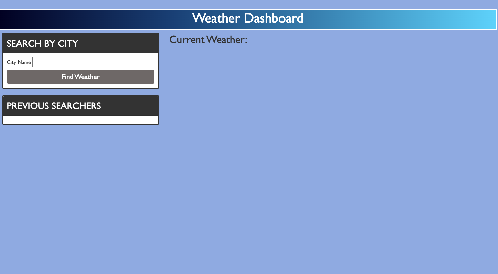
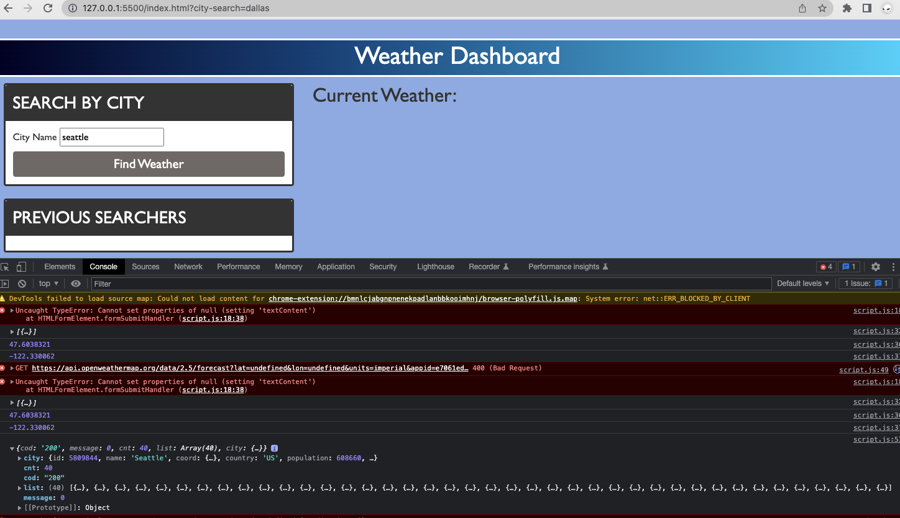

# Five Day Weather forcast

## Description 

For this project we were tasked with creating a five day weather forcast. As a user, this application was developed to show the current weather status for any given location.

The user will enter the location into the search bar. Then a five day forecast will appear!

During this project I learned a lot. Although the project was not completed by the deadline, I still was able to make some educational leaps. I finally understand how to link an API to a website, then grab specific data from that api.

Lastly, if your project is deployed, include a link to the deployed application here.

## Installation

there is no insstallation needed for this application, only basic web access.

## Usage 

First you enter in the desired city into the search bar

Then unfortunately I ran into some problems. The button needs to be pressed twice, then the data will appear

## License

For this project I used an MIT license

